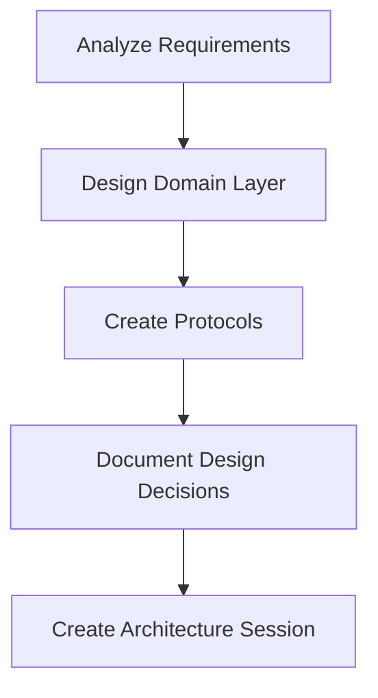
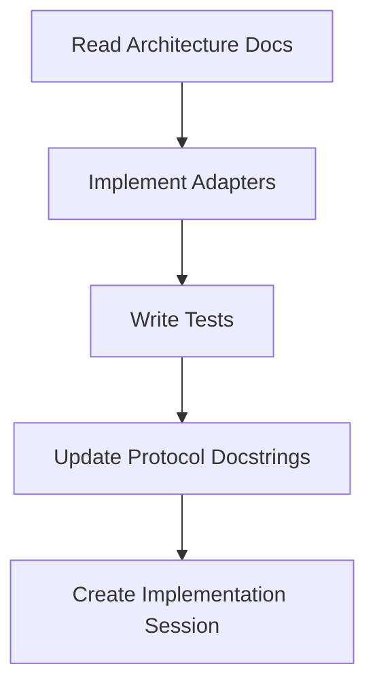
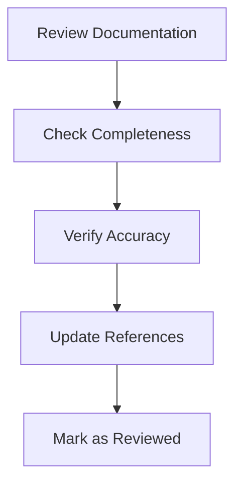

# Documentation Standards for AI-Native Development

## Overview
Comprehensive documentation standards for the MPA workflow, ensuring clarity, consistency, and maintainability of AI-assisted development artifacts.

## Documentation Philosophy

### 1. Documentation as Code
- Documentation lives with code
- Versioned alongside code changes
- Treated as first-class artifact
- Subject to review and testing

### 2. AI-Native Documentation
- Documents AI decision-making processes
- Records architectural rationale
- Provides context for AI agents
- Enables knowledge transfer between AI agents

### 3. Hexagonal Architecture Documentation
- **Domain Layer**: Schemas, protocols, business logic
- **Infrastructure Layer**: Adapters, tools, external integrations
- **Application Layer**: Use cases, workflows, APIs
- **MPA Layer**: AI agent roles, workflows, interactions

## Documentation Categories

### 1. Architecture Documentation
**Purpose:** High-level design decisions and rationale
**Location:** `.ai-sessions/architecture/`, `doc/`
**Format:** Markdown with Mermaid diagrams

```markdown
# Session: [Architecture Design Title]

**Date:** YYYY-MM-DD
**Architect:** GitHub Copilot
**Phase:** [Phase Number]

## Design Decisions
- **Problem:** [What problem are we solving?]
- **Options:** [Options considered]
- **Decision:** [Chosen option]
- **Rationale:** [Why this option was chosen]
```

### 2. Protocol Documentation
**Purpose:** Interface definitions with test scenarios
**Location:** `agent/domain/ports/[protocol_name].py`
**Format:** Python docstrings with `@TestScenarios`

```python
@TestScenarios([
    TestScenario(
        description="Save paper with valid data",
        given={"paper": Paper(title="Test", authors=["Author"])},
        when="save_paper is called",
        then="returns item key"
    )
])
class ReferenceManager(Protocol):
    """Interface for managing research references.
    
    This protocol defines the contract for reference management
    systems like Zotero, Mendeley, etc.
    
    Test Scenarios:
    1. Save paper with valid data
    2. Save paper with invalid data (raises error)
    3. Retrieve paper by ID
    4. List all papers
    """
    
    def save_paper(self, paper: Paper) -> str:
        """Save a paper to the reference manager.
        
        Args:
            paper: Paper object to save
            
        Returns:
            str: Unique identifier for the saved paper
            
        Raises:
            ValidationError: If paper data is invalid
            ConnectionError: If reference manager is unavailable
        """
        ...
```

### 3. Schema Documentation
**Purpose:** Data structure definitions
**Location:** `agent/domain/schemas/[schema_name].py`
**Format:** Pydantic models with field descriptions

```python
class Paper(BaseModel):
    """Research paper with metadata and content.
    
    Represents a scholarly article with full metadata
    and optional full-text content.
    """
    
    title: str = Field(
        ...,
        description="Title of the paper",
        min_length=1,
        max_length=1000
    )
    
    authors: List[str] = Field(
        default_factory=list,
        description="List of author names"
    )
    
    abstract: Optional[str] = Field(
        None,
        description="Abstract of the paper"
    )
    
    year: Optional[int] = Field(
        None,
        description="Publication year",
        ge=1900,
        le=2100
    )
    
    class Config:
        json_schema_extra = {
            "example": {
                "title": "Attention Is All You Need",
                "authors": ["Vaswani, Ashish", "et al."],
                "abstract": "The dominant sequence transduction models...",
                "year": 2017
            }
        }
```

### 4. Session Documentation
**Purpose:** Development session records
**Location:** `.ai-sessions/development/[phase]/`
**Format:** Structured Markdown with templates

```markdown
# Session: Implementation of ZoteroAdapter

**Date:** 2026-01-22
**Developer:** Aider + Qwen Max
**Phase:** 4.2
**Status:** Completed

## Context
- **Architecture:** 2026-01-21-zotero-mcp-design.md
- **Protocol:** ReferenceManager
- **Tools:** Aider, pytest, ruff

## Implementation Details
[Detailed implementation notes...]
```

### 5. API Documentation
**Purpose:** API endpoint specifications
**Location:** `openapi.yaml`, `doc/api/`
**Format:** OpenAPI 3.0 with examples

```yaml
paths:
  /papers:
    post:
      summary: Create a new paper
      description: Save a paper to the reference manager
      requestBody:
        required: true
        content:
          application/json:
            schema:
              $ref: '#/components/schemas/Paper'
            example:
              title: "Test Paper"
              authors: ["Author 1", "Author 2"]
      responses:
        '201':
          description: Paper created successfully
          content:
            application/json:
              schema:
                type: object
                properties:
                  paper_id:
                    type: string
                    example: "ZOTERO_12345"
```

## Documentation Standards

### 1. File Naming Conventions
- **Architecture:** `YYYY-MM-DD-[topic]-design.md`
- **Development:** `YYYY-MM-DD-[phase]-[topic]-implementation.md`
- **Debugging:** `YYYY-MM-DD-[issue]-debug.md`
- **Protocols:** `[protocol_name].py` (snake_case)
- **Schemas:** `[schema_name].py` (snake_case)

### 2. Content Standards
- **Headers:** Use proper hierarchy (H1, H2, H3)
- **Lists:** Use consistent bullet points or numbering
- **Code Blocks:** Include language specification
- **Links:** Use relative paths for internal links
- **Images:** Include alt text and captions

### 3. Code Documentation Standards
- **Docstrings:** Google style or NumPy style
- **Type Hints:** Always include type annotations
- **Examples:** Include usage examples
- **Error Conditions:** Document all possible errors

### 4. Diagram Standards
- **Mermaid:** Use for architecture diagrams
- **PlantUML:** Use for sequence diagrams
- **Graphviz:** Use for complex graphs
- **Format:** SVG or PNG with text alternatives

## Documentation Workflow

### 1. Architecture Phase


### 2. Implementation Phase


### 3. Review Phase


## Quality Standards

### 1. Completeness Checklist
- [ ] All protocols have `@TestScenarios`
- [ ] All schemas have field descriptions
- [ ] All sessions follow template structure
- [ ] All APIs have OpenAPI specifications
- [ ] All diagrams have text alternatives

### 2. Accuracy Checklist
- [ ] Documentation matches implementation
- [ ] Examples are working and up-to-date
- [ ] References are correct and accessible
- [ ] Version information is accurate
- [ ] Deprecation notices are clear

### 3. Consistency Checklist
- [ ] Consistent terminology throughout
- [ ] Consistent formatting and style
- [ ] Consistent naming conventions
- [ ] Consistent structure across documents
- [ ] Consistent linking patterns

## Documentation Tools

### 1. Static Site Generation
```bash
# Generate documentation site
mkdocs build

# Serve documentation locally
mkdocs serve
```

### 2. API Documentation
```bash
# Generate OpenAPI client libraries
openapi-generator generate -i openapi.yaml -g python

# Validate OpenAPI spec
openapi-spec-validator openapi.yaml
```

### 3. Documentation Testing
```bash
# Test docstring examples
pytest --doctest-modules agent/

# Validate Markdown links
markdown-link-check doc/*.md

# Check spelling
codespell doc/ *.md
```

## Maintenance Guidelines

### 1. Documentation Updates
- Update documentation alongside code changes
- Review documentation during code review
- Test documentation examples regularly
- Archive outdated documentation

### 2. Version Control
- Commit documentation with related code
- Use meaningful commit messages
- Tag documentation releases
- Maintain changelog

### 3. Review Process
- Peer review for technical accuracy
- Architecture review for design decisions
- User review for usability
- AI agent review for clarity

## Common Documentation Patterns

### 1. Protocol Documentation Pattern
```python
@TestScenarios([
    # Test scenario 1
    TestScenario(
        description="[What is being tested]",
        given="[Initial conditions]",
        when="[Action taken]",
        then="[Expected outcome]"
    ),
    # Test scenario 2
    ...
])
class ProtocolName(Protocol):
    """[Brief description of protocol purpose]
    
    [Detailed description including:
    - Responsibilities
    - Use cases
    - Implementation requirements
    - Error conditions
    ]
    
    Test Scenarios:
    1. [Scenario 1 description]
    2. [Scenario 2 description]
    ...
    
    Examples:
    ```python
    # Example usage
    adapter = ConcreteAdapter()
    result = adapter.method_name(arguments)
    ```
    """
    
    def method_name(self, param: Type) -> ReturnType:
        """[Method description]
        
        Args:
            param: [Parameter description]
            
        Returns:
            [Return value description]
            
        Raises:
            ErrorType: [When this error occurs]
        """
        ...
```

### 2. Session Documentation Pattern
```markdown
# Session: [Title]

**Date:** YYYY-MM-DD
**Author:** [Name/Role]
**Phase:** [Phase Number]
**Status:** [In Progress/Completed/Blocked]
**Goal:** [Clear, specific goal]

## Context
- **Related Documents:** [Links to related docs]
- **Standards:** [Standards followed]
- **Tools:** [Tools used]

## [Main Content Sections]
[Detailed content...]

## Results
- **Successes:** [What went well]
- **Challenges:** [What was difficult]
- **Learnings:** [Key takeaways]

## Next Steps
1. [Immediate next action]
2. [Future considerations]

## References
- [Reference 1]
- [Reference 2]
```

### 3. API Documentation Pattern
```yaml
paths:
  /resource:
    operationId: operationName
    summary: [Brief summary]
    description: |
      [Detailed description including:
      - Purpose
      - Behavior
      - Error conditions
      ]
    parameters:
      - name: paramName
        in: [query/path/header]
        description: [Parameter description]
        required: [true/false]
        schema:
          type: [data type]
    responses:
      '200':
        description: [Success description]
        content:
          application/json:
            schema:
              $ref: '#/components/schemas/ResponseSchema'
            examples:
              success:
                summary: [Example summary]
                value: [Example value]
```

## Documentation Review Checklist

### Before Publishing
- [ ] All required sections are present
- [ ] Content is accurate and up-to-date
- [ ] Examples are working and tested
- [ ] Links are valid and accessible
- [ ] Terminology is consistent
- [ ] Formatting is correct
- [ ] Images/diagrams are clear
- [ ] No sensitive information exposed

### After Publishing
- [ ] Documentation is accessible to target audience
- [ ] Feedback mechanism is available
- [ ] Version information is clear
- [ ] Search functionality works
- [ ] Mobile responsiveness is adequate
- [ ] Performance is acceptable

## References
- [MPA Workflow](mpa-workflow.md) - Development workflow
- [Testing Standards](testing-standards.md) - Testing methodology
- [.clinerules](../../.clinerules) - AI-Native development rules
- [Google Style Guide](https://google.github.io/styleguide/pyguide.html) - Python style guide
- [OpenAPI Specification](https://spec.openapis.org/oas/v3.0.3) - API documentation standard

---

**Version:** 1.0  
**Last Updated:** 2026-01-22  
**Maintainer:** Project Architect  
**Status:** Active
