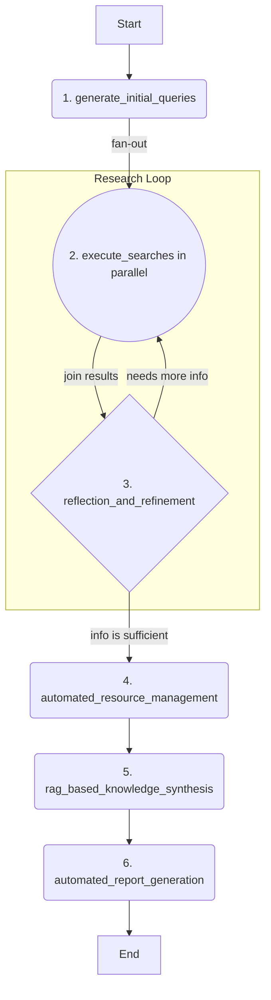

# Auto-Researcher

Auto-Researcher is an autonomous AI platform designed to automate the entire research lifecycle. It combines a sophisticated backend agent built with LangGraph and Google's Gemini models with a user-friendly interface (currently a web app, with a VS Code extension in development). The agent can take a single research topic, intelligently discover and manage academic literature, synthesize knowledge using a Retrieval-Augmented Generation (RAG) pipeline, and automatically generate a comprehensive, cited report.


For a detailed view of our future plans, please see our [Project Roadmap](ROADMAP.md).

## Features

- 🤖 **Autonomous Research Agent:** Employs a multi-stage LangGraph agent to automate research from topic to final report.
- 🧠 **Reflective & Iterative Search:** Intelligently generates search queries, reflects on results, and refines its strategy to cover knowledge gaps.
- 📚 **Automated Literature Management:** Discovers academic papers (Arxiv), finds open-access PDFs (Unpaywall), and automatically organizes them in a Zotero library.
- ✍️ **RAG-Powered Knowledge Synthesis:** Builds a vector knowledge base from full-text papers to generate deep, context-aware insights.
- 📄 **Cited Report Generation:** Produces a complete report on the research topic, fully supported by citations from the collected literature.
- 🐳 **Containerized & Ready-to-Run:** A fully containerized environment using Docker for easy setup and consistent development.
- 🔌 **API-First & Extensible:** Designed with a robust API, with a VS Code extension in development for a native research experience.

## Project Structure

The project is divided into two main directories:

-   `frontend/`: Contains the React application built with Vite.
-   `backend/`: Contains the LangGraph/FastAPI application, including the research agent logic.

## Getting Started (Docker Recommended)

This guide provides the recommended setup using Docker for a consistent and reproducible development environment.

**1. Prerequisites:**

*   **Docker and Docker Compose:** Ensure they are installed on your system.
*   **`GEMINI_API_KEY`**: The backend agent requires a Google Gemini API key.
    1.  Create a file named `.env` in the project root by copying the `.env.example` file.
    2.  Open the `.env` file and add your Gemini API key: `GEMINI_API_KEY="YOUR_ACTUAL_API_KEY"`

**2. Build and Run Services:**

Run the following command to build the container images and start all services in detached mode:

```bash
make dev-docker
```

**3. Accessing the Application:**

Once the containers are running:
-   The **React Frontend** will be available at `http://localhost:5173`.
-   The **Backend API** will be available at `http://localhost:8000`.
-   The **FastAPI/LangGraph UI** can be accessed at `http://localhost:8000/docs`.

**4. Testing the Setup:**

To verify that everything is working correctly, you can run the test suite.

*   **Run Unit & Integration Tests:**
    ```bash
    make test-backend-docker
    ```

*   **Run the End-to-End (E2E) Test:**
    ```bash
    make test-e2e-docker TOPIC="The impact of AI on climate change"
    ```

<details>
<summary><strong>Alternative: Local Setup without Docker</strong></summary>

If you prefer not to use Docker, you can set up and run the servers locally.

1.  Follow the prerequisite steps in the [CONTRIBUTING.md](CONTRIBUTING.md) guide to install dependencies.
2.  Run `make dev-local` from the root directory to start both frontend and backend servers with hot-reloading.

</details>

## How the Backend Agent Works

The core of the backend is a LangGraph agent that follows a sophisticated, multi-stage workflow for automated research. For a detailed explanation of the agent's architecture and state transitions, please see the technical documentation.



## Technologies Used

- [React](https://reactjs.org/) (with [Vite](https://vitejs.dev/)) - For the frontend user interface.
- [Tailwind CSS](https://tailwindcss.com/) - For styling.
- [Shadcn UI](https://ui.shadcn.com/) - For components.
- [LangGraph](https://github.com/langchain-ai/langgraph) - For building the backend research agent.
- [Google Gemini](https://ai.google.dev/models/gemini) - LLM for query generation, reflection, and answer synthesis.

## Contributing

We welcome contributions! Please see the [CONTRIBUTING.md](CONTRIBUTING.md) file for details on our testing process, code style, and submission guidelines.

## License

This project is licensed under the Apache License 2.0. See the [LICENSE](LICENSE) file for details.