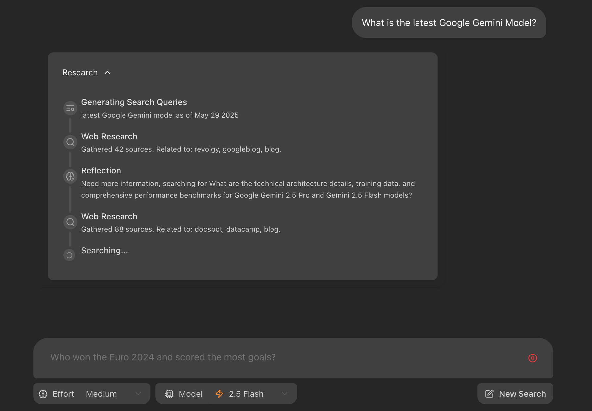
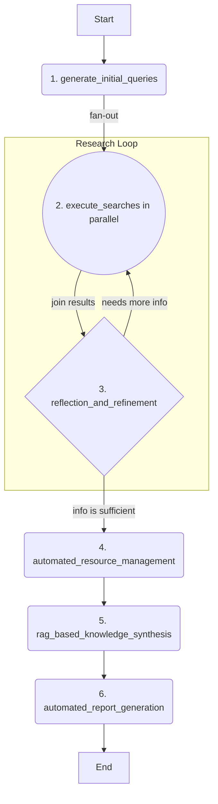

# Auto-Researcher

Auto-Researcher is an autonomous AI platform designed to automate the entire research lifecycle. It combines a sophisticated backend agent built with LangGraph and Google's Gemini models with a user-friendly interface (currently a web app, with a VS Code extension in development). The agent can take a single research topic, intelligently discover and manage academic literature, synthesize knowledge using a Retrieval-Augmented Generation (RAG) pipeline, and automatically generate a comprehensive, cited report.



For a detailed view of our future plans, please see our [Project Roadmap](ROADMAP.md).

## Features

- 🤖 **Autonomous Research Agent:** Employs a multi-stage LangGraph agent to automate research from topic to final report.
- 🧠 **Reflective & Iterative Search:** Intelligently generates search queries, reflects on results, and refines its strategy to cover knowledge gaps.
- 📚 **Automated Literature Management:** Discovers academic papers (Arxiv), finds open-access PDFs (Unpaywall), and automatically organizes them in a Zotero library.
- ✍️ **RAG-Powered Knowledge Synthesis:** Builds a vector knowledge base from full-text papers to generate deep, context-aware insights.
- 📄 **Cited Report Generation:** Produces a complete report on the research topic, fully supported by citations from the collected literature.
- 🐳 **Containerized & Ready-to-Run:** A fully containerized environment using Docker for easy setup and consistent development.
- 🔌 **API-First & Extensible:** Designed with a robust API, with a VS Code extension in development for a native research experience.

## Project Structure

The project is divided into three main directories:

-   `frontend/`: Contains the React application built with Vite (the legacy web UI).
-   `backend/`: Contains the LangGraph/FastAPI application, including the research agent logic.
-   `vscode-extension/`: Contains the new VS Code extension, which is the primary user interface under active development.

## Getting Started (Dev Container Recommended)

This project is optimized for a containerized development experience using **VS Code Dev Containers**. This is the recommended approach as it provides a consistent, pre-configured environment for both frontend and backend development.

### Development Environments

We have configured two separate Dev Container environments:

-   **Frontend Development:** The default configuration (`.devcontainer/devcontainer.json`), which attaches to the `vscode-dev` service. Use this for working on the React application or the VS Code extension.
-   **Backend Development:** A separate configuration (`.devcontainer/devcontainer.json.backend`) for working on the Python-based LangGraph agent, which attaches to the `langgraph-api` service.

To switch between environments, you simply need to rename the configuration files in the `.devcontainer` directory. For example, to activate the backend environment:

```bash
# Back up the current frontend config
mv .devcontainer/devcontainer.json .devcontainer/devcontainer.json.frontend

# Activate the backend config
mv .devcontainer/devcontainer.json.backend .devcontainer/devcontainer.json
```

### Prerequisites

*   **VS Code** with the [Dev Containers extension](https://marketplace.visualstudio.com/items?itemName=ms-vscode-remote.remote-containers).
*   **Docker and Docker Compose:** Ensure they are installed and running on your system.
*   **LLM Provider Configuration**: The backend agent uses `litellm` to support various LLM providers.
    1.  Create a `.env` file by copying `.env.example`.
    2.  Add your API key (e.g., `GEMINI_API_KEY="YOUR_API_KEY"`).

### Launching the Dev Environment

1.  **Build and Run Services:**
    Before launching the Dev Container for the first time, you need to build the images and start the services:
    ```bash
    make dev-docker
    ```
    This command builds the necessary Docker images (with the VS Code Server pre-installed for faster startup) and starts the database and other services.

2.  **Open in Dev Container:**
    -   Open the project folder in VS Code.
    -   Click the green "><" icon in the bottom-left corner of the window.
    -   Select **"Reopen in Container"**.

    VS Code will automatically attach to the correct service (`vscode-dev` for frontend or `langgraph-api` for backend) based on your `devcontainer.json` configuration.

### Accessing the Application

Once the containers are running:
-   The **React Frontend** will be available at `http://localhost:5173`.
-   The **Backend API** will be available at `http://localhost:8000`.
-   The **FastAPI/LangGraph UI** can be accessed at `http://localhost:8000/docs`.

### Testing the Setup

This project employs a comprehensive, multi-layered testing strategy to ensure quality across the backend, frontend, and VS Code extension. This includes unit, integration, and end-to-end (E2E) behavioral snapshot tests.

For a complete guide on the testing philosophy, what to run, and how to run it, please refer to the canonical **[TESTING.md](TESTING.md)** document. It is the single source of truth for all verification procedures.

> The E2E snapshot testing methodology is also detailed in `GEMINI.md`.

<details>
<summary><strong>Alternative: Local Setup without Docker</strong></summary>

If you prefer not to use Docker, you can set up and run the servers locally.

1.  Follow the prerequisite steps in the [CONTRIBUTING.md](CONTRIBUTING.md) guide to install dependencies.
2.  Run `make dev-local` from the root directory to start both frontend and backend servers with hot-reloading.

</details>

## How the Backend Agent Works

The core of the backend is a LangGraph agent that follows a sophisticated, multi-stage workflow for automated research. For a detailed explanation of the agent's architecture and state transitions, please see the technical documentation.



## Technologies Used

- [React](https://reactjs.org/) (with [Vite](https://vitejs.dev/)) - For the frontend user interface.
- [Tailwind CSS](https://tailwindcss.com/) - For styling.
- [Shadcn UI](https://ui.shadcn.com/) - For components.
- [LangGraph](https://github.com/langchain-ai/langgraph) - For building the backend research agent.
- [Google Gemini](https://ai.google.dev/models/gemini) - LLM for query generation, reflection, and answer synthesis.

## Contributing

This project follows an **API Contract First** development model. Before contributing, especially for features involving frontend-backend interaction, please read our **[Unified Session-Driven Workflow](doc/WORKFLOW_STRATEGY.md)** to understand the process.

We welcome contributions! Please see the [CONTRIBUTING.md](CONTRIBUTING.md) file for details on our testing process, code style, and submission guidelines.

## License

This project is licensed under the Apache License 2.0. See the [LICENSE](LICENSE) file for details.