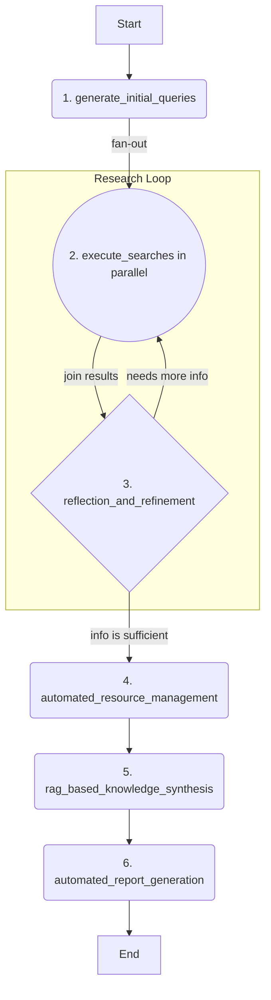

# Auto-Researcher

Auto-Researcher is an autonomous AI platform designed to automate the entire research lifecycle. It combines a sophisticated backend agent built with LangGraph and Google's Gemini models with a user-friendly interface (currently a web app, with a VS Code extension in development). The agent can take a single research topic, intelligently discover and manage academic literature, synthesize knowledge using a Retrieval-Augmented Generation (RAG) pipeline, and automatically generate a comprehensive, cited report.


## Features

- 🤖 **Autonomous Research Agent:** Employs a multi-stage LangGraph agent to automate research from topic to final report.
- 🧠 **Reflective & Iterative Search:** Intelligently generates search queries, reflects on results, and refines its strategy to cover knowledge gaps.
- 📚 **Automated Literature Management:** Discovers academic papers (Arxiv), finds open-access PDFs (Unpaywall), and automatically organizes them in a Zotero library.
- ✍️ **RAG-Powered Knowledge Synthesis:** Builds a vector knowledge base from full-text papers to generate deep, context-aware insights.
- 📄 **Cited Report Generation:** Produces a complete report on the research topic, fully supported by citations from the collected literature.
- 🐳 **Containerized & Ready-to-Run:** A fully containerized environment using Docker for easy setup and consistent development.
- 🔌 **API-First & Extensible:** Designed with a robust API, with a VS Code extension in development for a native research experience.

## Project Structure

The project is divided into two main directories:

-   `frontend/`: Contains the React application built with Vite.
-   `backend/`: Contains the LangGraph/FastAPI application, including the research agent logic.

## Getting Started with Docker (Recommended)

This guide provides the recommended setup using Docker for a consistent and reproducible development environment.

**1. Prerequisites:**

*   **Docker and Docker Compose:** Ensure they are installed on your system.
*   **`GEMINI_API_KEY`**: The backend agent requires a Google Gemini API key.
    1.  Create a file named `.env` in the project root by copying the `.env.example` file.
    2.  Open the `.env` file and add your Gemini API key: `GEMINI_API_KEY="YOUR_ACTUAL_API_KEY"`

**2. Build and Run Services:**

Run the following command to build the container images and start the frontend, backend, and database services in detached mode:

```bash
docker-compose -f docker-compose-dev.yml up --build -d
```

**3. Accessing the Application:**

Once the containers are running:
-   The **React Frontend** will be available at `http://localhost:5173`.
-   The **Backend API** will be available at `http://localhost:8000`.
-   The **FastAPI/LangGraph UI** can be accessed at `http://localhost:8000/docs`.

**4. Testing the Setup:**

You can run the entire test suite inside the running Docker containers to verify that everything is working correctly.

**A. Running Unit & Integration Tests (BDD):**

This command executes the `pytest` suite, which includes unit tests and the behavior-driven (BDD) scenarios.

```bash
docker-compose exec backend bash -c "uv pip install -e '.[dev]' && pytest"
```
*   `uv pip install -e '.[dev]'`: This ensures all testing dependencies are installed inside the container.
*   `pytest`: This runs the test suite. You should see all tests passing.

**B. Running the End-to-End (E2E) Test:**

This script simulates a real client interacting with the agent from start to finish.

```bash
docker-compose exec backend bash -c "uv run python examples/e2e_test_case.py 'The impact of AI on climate change'"
```
You can replace the query with any topic of your choice.

<details>
<summary><strong>Alternative: Local Setup without Docker</strong></summary>

If you prefer not to use Docker, you can set up the project locally, but you will need to manage Python and Node.js environments yourself.

**1. Prerequisites:**

-   Node.js and npm (or yarn/pnpm)
-   Python 3.11+
-   `GEMINI_API_KEY` (set up as described above)

**2. Install Dependencies:**

*   **Backend:** `cd backend && pip install .`
*   **Frontend:** `cd frontend && npm install`

**3. Run Development Servers:**

*   Run `make dev` from the root directory to start both frontend and backend servers with hot-reloading.

</details>

## How the Backend Agent Works (High-Level)

The core of the backend is a LangGraph agent defined in `backend/src/agent/graph.py`. It now follows a sophisticated four-stage workflow designed for automated research:



1.  **Intelligent Literature Discovery & Reflection:**
    -   The agent takes a research topic and generates a set of initial search queries.
    -   It executes these queries in parallel against academic search APIs (like Arxiv).
    -   Crucially, it then enters a **reflection loop**. The agent analyzes the search results to see if they are sufficient.
    -   If there are knowledge gaps, it generates new, more specific queries and re-runs the parallel search. This loop continues until the information is comprehensive or a maximum number of iterations is reached.

2.  **Automated Resource Management:**
    -   Once the literature search is complete, the agent finds DOIs (Digital Object Identifiers) in the collected abstracts.
    -   It uses the Unpaywall API to find open-access PDF versions of the papers.
    -   It then uses the Zotero API to automatically create a library entry for each paper, attaching the PDF if found.

3.  **RAG-based Knowledge Synthesis:**
    -   The agent downloads the full text from the discovered PDF URLs.
    -   It extracts the text, splits it into manageable chunks, and generates vector embeddings for each chunk using a Gemini model.
    -   These chunks and their embeddings are stored in a PostgreSQL database with the `pgvector` extension, creating a powerful Retrieval-Augmented Generation (RAG) knowledge base.

4.  **Automated Report Generation:**
    -   Finally, the agent uses the synthesized knowledge in the RAG database to generate a comprehensive report that answers the initial research topic, complete with citations.

## Project Upgrade Plan: Towards an Automated Research Platform

This project is undergoing a significant upgrade to transform it from a demo into a powerful, VS Code-native automated research platform. The development is divided into three phases.

### Phase 1: Backend Foundation and Core Agent (Complete)

This foundational phase has been completed. We have built a robust, "headless" AI agent that is callable via an API and fully implements the four-stage research workflow described above.

**Key deliverables from this phase:**
-   **Functional FastAPI Server:** The backend is served via FastAPI, with database initialization handled on startup.
-   **PostgreSQL + pgvector DB:** A PostgreSQL database with the `pgvector` extension is integrated for RAG.
-   **Four-Stage LangGraph Agent:** The core agent logic is implemented in `backend/src/agent/graph.py`.
-   **Integrated Tooling:** The agent uses `arxiv`, `unpaywall`, `pyzotero`, and `litellm` to perform its tasks.
-   **Containerized Environment:** The entire backend stack can be run using Docker Compose.

### Phase 2: VS Code Skeleton and Static Display (In Progress)

The next phase focuses on building the user-facing component of the platform: a VS Code extension. The goal is to create a "read-only" view of the research process.

**Detailed Plan:**
1.  **Develop the basic VS Code Extension:**
    -   Set up a new TypeScript project for the extension.
    -   Implement the three-panel layout as described in the technical documentation:
        -   **Left Panel (Research Asset Library):** A TreeView to display research resources (papers, notes).
        -   **Center Panel (Dynamic Manuscript):** The main editor, where the final report will be shown.
        -   **Right Panel (AI Control Panel):** A Webview to show the agent's status and thinking process.
2.  **API Integration (Read-Only):**
    -   The extension will call the backend API to fetch the status and results of a completed research task.
    -   The data will be used to populate the three panels (e.g., list of papers in the asset library, final report in the editor, agent logs in the control panel).
3.  **Static Visualization:**
    -   The primary goal is to prove that the frontend can successfully connect to and display data from the backend. All interactions that trigger new runs will be handled via API tools (like Insomnia or curl) for now.

### Phase 3: Real-time Interaction and Dynamic Collaboration (Future)

The final phase will bring the platform to life by enabling full, real-time, two-way communication between the user and the agent.

**Detailed Plan:**
1.  **WebSocket Integration:**
    -   Implement WebSocket communication between the VS Code extension and the FastAPI backend.
    -   This will allow the agent to stream its "thoughts" and progress to the AI Control Panel in real-time.
2.  **Interactive Controls:**
    -   Build the UI components in the AI Control Panel (using React and the VS Code Webview UI Toolkit) that allow the user to:
        -   Start new research tasks with a natural language prompt.
        -   Observe the agent's progress.
        -   Implement "human-in-the-loop" (HITL) decision points, where the agent pauses and asks for user input before proceeding.
3.  **Dynamic Document Editing:**
    -   The agent will be able to directly edit the Markdown file in the center panel using the VS Code Workspace API. This will allow the agent to collaboratively write the report with the user.


## Technologies Used

- [React](https://reactjs.org/) (with [Vite](https://vitejs.dev/)) - For the frontend user interface.
- [Tailwind CSS](https://tailwindcss.com/) - For styling.
- [Shadcn UI](https://ui.shadcn.com/) - For components.
- [LangGraph](https://github.com/langchain-ai/langgraph) - For building the backend research agent.
- [Google Gemini](https://ai.google.dev/models/gemini) - LLM for query generation, reflection, and answer synthesis.

## Testing

The test suite is designed to be run within the development Docker container to ensure a consistent environment.

**1. Start the Services:**

First, bring up the backend services, including the PostgreSQL database required for testing:

```bash
docker-compose -f docker-compose-dev.yml up -d
```

**2. Install Dependencies and Run Unit/Integration Tests:**

The following command will execute the entire unit and integration test suite. It first ensures all development and testing dependencies are installed before running `pytest`.

```bash
docker-compose exec backend bash -c "uv pip install -e '.[dev]' && pytest"
```

This command does the following:
- `docker-compose exec backend`: Executes a command inside the running `backend` service container.
- `uv pip install -e '.[dev]'`: Installs all dependencies, including the optional `[dev]` dependencies (like `pytest`, `pytest-bdd`, etc.) defined in `pyproject.toml`.
- `pytest`: Runs the test suite.

You should see output indicating that all 37 tests have passed.

### End-to-End (E2E) Test vs. BDD

This project includes both Behavior-Driven Development (BDD) tests and an End-to-End (E2E) test case. They serve different but complementary purposes.

-   **BDD Tests (`tests/features/agent_workflow.feature`):**
    -   **Focus:** Behavior. They describe *what* the agent should do in specific scenarios using a human-readable Gherkin syntax (`Given-When-Then`).
    -   **Scope:** They test the backend's internal logic and state transitions, acting as a form of integration test.
    -   **Purpose:** To ensure the agent's logic correctly implements the specified business rules and to serve as living documentation.

-   **E2E Test (`examples/e2e_test_case.py`):**
    -   **Focus:** Flow. It simulates a real client interacting with the entire running system from start to finish.
    -   **Scope:** It tests the full application stack, from the WebSocket API endpoint through the entire agent execution to the final result.
    -   **Purpose:** To verify that all components (API, agent, tools, database) are correctly integrated and the system works as a whole.

In a typical CI/CD pipeline, the faster BDD/integration tests would run before the more comprehensive (and slower) E2E tests to provide quicker feedback.

#### Running the E2E Test Case

This script demonstrates how a client application can interact with the agent.

**1. Ensure Services are Running:**

Make sure the backend services are running as described in the testing section above.

**2. Run the E2E Script:**

Execute the following command from the project's root directory. This script will connect to the agent via its API, assign it a research task, and stream the results to your console, finally printing the complete report.

```bash
docker-compose exec backend bash -c "uv run python examples/e2e_test_case.py 'The impact of AI on climate change'"
```

You can replace `'The impact of AI on climate change'` with any research topic you are interested in.

## License

This project is licensed under the Apache License 2.0. See the [LICENSE](LICENSE) file for details.

## Tools

This project includes a collection of utility scripts located in the `scripts` directory. These tools are managed and executed via the root `Makefile`.

### List Models

This tool fetches the list of available models from the Google Generative AI API and saves them to `logs/models.log`.

**Prerequisites:**

-   Ensure the `GEMINI_API_KEY` environment variable is set.

**Usage:**

Run the following command from the project root directory:
    ```bash
    make list-models
    ```