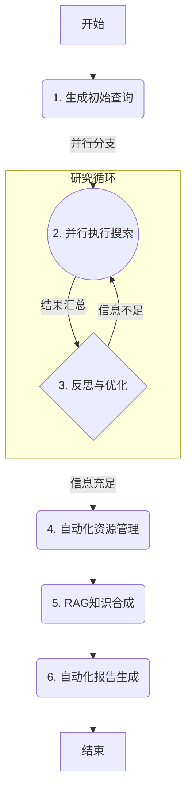

# Auto-Researcher

**Auto-Researcher** 是一个自主的 AI 平台，旨在自动化整个研究生命周期。它将一个使用 LangGraph 和 Google Gemini 模型构建的复杂后端代理与一个用户友好的界面（目前是一个Web应用，未来将开发为VS Code扩展）相结合。该代理能够接收一个研究主题，智能地发现和管理学术文献，使用检索增强生成（RAG）管道合成知识，并自动生成一份内容全面、附带引用的研究报告。


关于项目未来的详细规划，请参阅我们的 [项目路线图 (Project Roadmap)](ROADMAP.md)。

## 功能

- 🤖 **自主研究代理:** 采用多阶段 LangGraph 代理，实现从研究课题到最终报告的全流程自动化。
- 🧠 **反思与迭代搜索:** 智能生成搜索查询，对结果进行反思，并优化策略以填补知识空白。
- 📚 **自动化文献管理:** 发现学术论文 (Arxiv)，查找开放获取的PDF (Unpaywall)，并自动在 Zotero 中整理文献库。
- ✍️ **RAG 驱动的知识合成:** 从论文全文构建向量知识库，以生成深刻的、与上下文相关的见解。
- 📄 **生成带引用的报告:** 产出一份完整的、包含从所收集文献中引用的研究报告。
- 🐳 **容器化且开箱即用:** 使用 Docker 提供完全容器化的环境，便于轻松设置和一致的开发体验。
- 🔌 **API优先与可扩展:** 采用强大的API优先设计，并正在开发 VS Code 扩展以提供原生研究体验。

## 项目结构

该项目分为两个主要目录：

- `frontend/`: 包含使用 Vite 构建的 React 应用程序。
- `backend/`: 包含 LangGraph/FastAPI 应用程序，包括研究代理逻辑。

## 快速入门 (推荐使用 Docker)

本指南提供推荐的 Docker 设置流程，以确保开发环境的一致性和可复现性。

**1. 先决条件:**

*   **Docker 和 Docker Compose:** 确保它们已安装在您的系统上。
*   **`GEMINI_API_KEY`**: 后端代理需要一个 Google Gemini API 密钥。
    1.  通过复制项目根目录中的 `.env.example` 文件来创建一个名为 `.env` 的文件。
    2.  打开 `.env` 文件并添加您的 Gemini API 密钥：`GEMINI_API_KEY="YOUR_ACTUAL_API_KEY"`

**2. 构建并运行服务:**

运行以下命令来构建容器镜像，并在后台模式下启动所有服务：

```bash
make dev-docker
```

**3. 访问应用:**

容器启动后：
-   **React 前端** 将在 `http://localhost:5173` 上可用。
-   **后端 API** 将在 `http://localhost:8000` 上可用。
-   **FastAPI/LangGraph UI** (FastAPI 文档) 可在 `http://localhost:8000/docs` 访问。

**4. 测试安装:**

为了验证一切是否正常工作，您可以运行测试套件。

*   **运行单元和集成测试:**
    ```bash
    make test-backend-docker
    ```

*   **运行端到端 (E2E) 测试:**
    ```bash
    make test-e2e-docker TOPIC="人工智能对气候变化的影响"
    ```

<details>
<summary><strong>备选方案：无 Docker 环境本地设置</strong></summary>

如果您不想使用 Docker，也可以在本地设置和运行服务。

1.  请遵循 [CONTRIBUTING.md](CONTRIBUTING.md) 指南中的先决条件步骤来安装依赖。
2.  在项目根目录运行 `make dev-local` 来同时启动前端和后端开发服务器（支持热重载）。

</details>

## 后端代理工作原理

后端的核心是一个 LangGraph 代理，它遵循一个复杂的、多阶段的工作流来执行自动化研究。关于代理架构和状态转换的详细说明，请参阅技术文档。



## 使用的技术

- [React](https://reactjs.org/) (与 [Vite](https://vitejs.dev/)) - 用于前端用户界面。
- [Tailwind CSS](https://tailwindcss.com/) - 用于样式设计。
- [Shadcn UI](https://ui.shadcn.com/) - 用于组件。
- [LangGraph](https://github.com/langchain-ai/langgraph) - 用于构建后端研究代理。
- [Google Gemini](https://ai.google.dev/models/gemini) - 用于查询生成、反思和答案合成的 LLM。

## 贡献

我们欢迎各种贡献！有关我们的测试流程、代码风格和提交流程的详细信息，请参阅 [CONTRIBUTING.md](CONTRIBUTING.md) 文件。

## 许可证

该项目根据 Apache License 2.0 授权。有关详细信息，请参阅 [LICENSE](LICENSE) 文件。