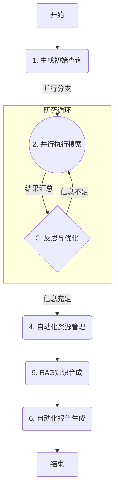

# Auto-Researcher

**Auto-Researcher** 是一个自主的 AI 平台，旨在自动化整个研究生命周期。它将一个使用 LangGraph 和 Google Gemini 模型构建的复杂后端代理与一个用户友好的界面（目前是一个Web应用，未来将开发为VS Code扩展）相结合。该代理能够接收一个研究主题，智能地发现和管理学术文献，使用检索增强生成（RAG）管道合成知识，并自动生成一份内容全面、附带引用的研究报告。


## 功能

- 🤖 **自主研究代理:** 采用多阶段 LangGraph 代理，实现从研究课题到最终报告的全流程自动化。
- 🧠 **反思与迭代搜索:** 智能生成搜索查询，对结果进行反思，并优化策略以填补知识空白。
- 📚 **自动化文献管理:** 发现学术论文 (Arxiv)，查找开放获取的PDF (Unpaywall)，并自动在 Zotero 中整理文献库。
- ✍️ **RAG 驱动的知识合成:** 从论文全文构建向量知识库，以生成深刻的、与上下文相关的见解。
- 📄 **生成带引用的报告:** 产出一份完整的、包含从所收集文献中引用的研究报告。
- 🐳 **容器化且开箱即用:** 使用 Docker 提供完全容器化的环境，便于轻松设置和一致的开发体验。
- 🔌 **API优先与可扩展:** 采用强大的API优先设计，并正在开发 VS Code 扩展以提供原生研究体验。

## 项目结构

该项目分为两个主要目录：

- `frontend/`: 包含使用 Vite 构建的 React 应用程序。
- `backend/`: 包含 LangGraph/FastAPI 应用程序，包括研究代理逻辑。

## 使用 Docker 快速入门 (推荐)

本指南提供推荐的 Docker 设置流程，以确保开发环境的一致性和可复现性。

**1. 先决条件:**

*   **Docker 和 Docker Compose:** 确保它们已安装在您的系统上。
*   **`GEMINI_API_KEY`**: 后端代理需要一个 Google Gemini API 密钥。
    1.  通过复制项目根目录中的 `.env.example` 文件来创建一个名为 `.env` 的文件。
    2.  打开 `.env` 文件并添加您的 Gemini API 密钥：`GEMINI_API_KEY="YOUR_ACTUAL_API_KEY"`

**2. 构建并运行服务:**

运行以下命令来构建容器镜像，并在后台模式下启动前端、后端和数据库服务：

```bash
docker-compose -f docker-compose-dev.yml up --build -d
```

**3. 访问应用:**

容器启动后：
-   **React 前端** 将在 `http://localhost:5173` 上可用。
-   **后端 API** 将在 `http://localhost:8000` 上可用。
-   **FastAPI/LangGraph UI** (FastAPI 文档) 可在 `http://localhost:8000/docs` 访问。

**4. 测试安装:**

您可以在运行中的 Docker 容器内执行完整的测试套件，以验证一切是否正常工作。

**A. 运行单元和集成测试 (BDD):**

此命令将执行 `pytest` 测试套件，其中包含单元测试和行为驱动开发 (BDD) 场景。

```bash
docker-compose exec backend bash -c "uv pip install -e '.[dev]' && pytest"
```
*   `uv pip install -e '.[dev]'`: 确保所有测试依赖项都已在容器内安装。
*   `pytest`: 运行测试套件。您应该能看到所有测试都通过。

**B. 运行端到端 (E2E) 测试:**

该脚本模拟一个真实的客户端从头到尾与代理进行交互。

```bash
docker-compose exec backend bash -c "uv run python examples/e2e_test_case.py '人工智能对气候变化的影响'"
```
您可以将查询内容替换为您感兴趣的任何主题。

<details>
<summary><strong>备选方案：无 Docker 环境本地设置</strong></summary>

如果您不想使用 Docker，也可以在本地设置项目，但需要您自行管理 Python 和 Node.js 环境。

**1. 先决条件:**

-   Node.js 和 npm (或 yarn/pnpm)
-   Python 3.11+
-   `GEMINI_API_KEY` (按上文所述设置)

**2. 安装依赖:**

*   **后端:** `cd backend && pip install .`
*   **前端:** `cd frontend && npm install`

**3. 运行开发服务器:**

*   在项目根目录运行 `make dev` 来同时启动前端和后端开发服务器（支持热重载）。

</details>

## 后端代理工作原理 (高级)

后端的核心是 `backend/src/agent/graph.py` 中定义的 LangGraph 代理。它现在遵循一个为自动化研究设计的复杂的四阶段工作流：



1.  **智能文献发现与反思:**
    -   代理接收一个研究主题，并生成一组初始搜索查询。
    -   它会**并行**执行这些查询，请求学术搜索API（如Arxiv）。
    -   关键的是，它随后进入一个 **反思循环**。代理分析搜索结果以判断其是否充分。
    -   如果存在知识差距，它会生成新的、更具体的查询并重新运行并行搜索。此循环将持续进行，直到信息全面或达到最大迭代次数。

2.  **自动化资源管理:**
    -   文献搜索完成后，代理会在收集到的摘要中查找DOI（数字对象标识符）。
    -   它使用 Unpaywall API 查找论文的开放获取PDF版本。
    -   然后，它使用 Zotero API 为每篇论文自动创建一个文献库条目，并附上找到的PDF。

3.  **基于RAG的知识合成:**
    -   代理从发现的PDF URL下载全文。
    -   它提取文本，将其分割成易于管理的小块，并使用Gemini模型为每个块生成向量嵌入。
    -   这些文本块及其嵌入存储在带有 `pgvector` 扩展的PostgreSQL数据库中，从而创建了一个强大的检索增强生成（RAG）知识库。

4.  **自动化报告生成:**
    -   最后，代理使用RAG数据库中合成的知识生成一份全面的报告，以回答最初的研究主题，并附上引文。

## 项目升级计划：迈向自动化研究平台

该项目正在进行重大升级，旨在从一个演示项目转变为一个强大的、VS Code原生的自动化研究平台。开发分为三个阶段。

### 第一阶段：后端基础与核心代理 (已完成)

这个基础阶段已经完成。我们构建了一个健壮的、“无头”的AI代理，它可以通过API调用，并完全实现了上述的四阶段研究工作流。

**此阶段的主要交付成果:**
-   **功能性的FastAPI服务器:** 后端通过FastAPI提供服务，并在应用启动时处理数据库初始化。
-   **PostgreSQL + pgvector数据库:** 集成了带有`pgvector`扩展的PostgreSQL数据库用于RAG。
-   **四阶段LangGraph代理:** 核心代理逻辑在`backend/src/agent/graph.py`中实现。
-   **集成工具:** 代理使用`arxiv`、`unpaywall`、`pyzotero`和`litellm`来执行其任务。
-   **容器化环境:** 整个后端堆栈可以使用Docker Compose运行。

### 第二阶段：VS Code骨架与静态展示 (进行中)

下一个阶段专注于构建平台面向用户的组件：一个VS Code扩展。目标是创建一个研究过程的“只读”视图。

**详细计划:**
1.  **开发基础VS Code扩展:**
    -   为扩展设置一个新的TypeScript项目。
    -   按照技术文档中的描述实现三栏布局：
        -   **左侧面板 (研究资产库):** 一个TreeView，用于显示研究资源（论文、笔记）。
        -   **中间面板 (动态手稿):** 主编辑器，将显示最终报告。
        -   **右侧面板 (AI控制面板):** 一个Webview，用于显示代理的状态和思考过程。
2.  **API集成 (只读):**
    -   扩展将调用后端API以获取已完成研究任务的状态和结果。
    -   数据将用于填充三个面板（例如，资产库中的论文列表、编辑器中的最终报告、控制面板中的代理日志）。
3.  **静态可视化:**
    -   主要目标是证明前端可以成功连接并显示来自后端的数据。目前，所有触发新运行的交互都将通过API工具（如Insomnia或curl）处理。

### 第三阶段：实时交互与动态协作 (未来)

最后一个阶段将通过在用户和代理之间实现完全的、实时的、双向的通信，使平台焕发生机。

**详细计划:**
1.  **WebSocket集成:**
    -   在VS Code扩展和FastAPI后端之间实现WebSocket通信。
    -   这将允许代理将其“思考”和进度实时流式传输到AI控制面板。
2.  **交互式控件:**
    -   在AI控制面板中构建UI组件（使用React和VS Code Webview UI Toolkit），允许用户：
        -   用自然语言提示开始新的研究任务。
        -   观察代理的进度。
        -   实现“人在环路”（HITL）决策点，即代理暂停并请求用户输入后再继续。
3.  **动态文档编辑:**
    -   代理将能够使用VS Code Workspace API直接编辑中间面板中的Markdown文件。这将允许代理与用户协同撰写报告。


## 使用的技术

- [React](https://reactjs.org/) (与 [Vite](https://vitejs.dev/)) - 用于前端用户界面。
- [Tailwind CSS](https://tailwindcss.com/) - 用于样式设计。
- [Shadcn UI](https://ui.shadcn.com/) - 用于组件。
- [LangGraph](https://github.com/langchain-ai/langgraph) - 用于构建后端研究代理。
- [Google Gemini](https://ai.google.dev/models/gemini) - 用于查询生成、反思和答案合成的 LLM。

## 测试

测试套件被设计为在开发Docker容器内运行，以确保环境的一致性。

**1. 启动服务:**

首先，启动后端服务，包括测试所需的PostgreSQL数据库：

```bash
docker-compose -f docker-compose-dev.yml up -d
```

**2. 安装依赖并运行单元/集成测试:**

以下命令将执行完整的单元和集成测试套件。在运行`pytest`之前，它会首先确保所有的开发和测试依赖都已正确安装。

```bash
docker-compose exec backend bash -c "uv pip install -e '.[dev]' && pytest"
```

该命令执行以下操作：
- `docker-compose exec backend`: 在正在运行的 `backend` 服务容器内执行一个命令。
- `uv pip install -e '.[dev]'`: 安装所有依赖项，包括在 `pyproject.toml` 中定义的 `[dev]` 可选依赖（如 `pytest`, `pytest-bdd` 等）。
- `pytest`: 运行测试套件。

您应该能看到所有 37 个测试都已通过的输出。
1.  **开发基础VS Code扩展:**
    -   为扩展设置一个新的TypeScript项目。
    -   按照技术文档中的描述实现三栏布局：
        -   **左侧面板 (研究资产库):** 一个TreeView，用于显示研究资源（论文、笔记）。
        -   **中间面板 (动态手稿):** 主编辑器，将显示最终报告。
        -   **右侧面板 (AI控制面板):** 一个Webview，用于显示代理的状态和思考过程。
2.  **API集成 (只读):**
    -   扩展将调用后端API以获取已完成研究任务的状态和结果。
    -   数据将用于填充三个面板（例如，资产库中的论文列表、编辑器中的最终报告、控制面板中的代理日志）。
3.  **静态可视化:**
    -   主要目标是证明前端可以成功连接并显示来自后端的数据。目前，所有触发新运行的交互都将通过API工具（如Insomnia或curl）处理。

### 第三阶段：实时交互与动态协作 (未来)

最后一个阶段将通过在用户和代理之间实现完全的、实时的、双向的通信，使平台焕发生机。

**详细计划:**
1.  **WebSocket集成:**
    -   在VS Code扩展和FastAPI后端之间实现WebSocket通信。
    -   这将允许代理将其“思考”和进度实时流式传输到AI控制面板。
2.  **交互式控件:**
    -   在AI控制面板中构建UI组件（使用React和VS Code Webview UI Toolkit），允许用户：
        -   用自然语言提示开始新的研究任务。
        -   观察代理的进度。
        -   实现“人在环路”（HITL）决策点，即代理暂停并请求用户输入后再继续。
3.  **动态文档编辑:**
    -   代理将能够使用VS Code Workspace API直接编辑中间面板中的Markdown文件。这将允许代理与用户协同撰写报告。


## 使用的技术

- [React](https://reactjs.org/) (与 [Vite](https://vitejs.dev/)) - 用于前端用户界面。
- [Tailwind CSS](https://tailwindcss.com/) - 用于样式设计。
- [Shadcn UI](https://ui.shadcn.com/) - 用于组件。
- [LangGraph](https://github.com/langchain-ai/langgraph) - 用于构建后端研究代理。
- [Google Gemini](https://ai.google.dev/models/gemini) - 用于查询生成、反思和答案合成的 LLM。

## 测试

测试套件被设计为在开发Docker容器内运行，以确保环境的一致性。

**1. 启动服务:**

首先，启动后端服务，包括测试所需的PostgreSQL数据库：

```bash
docker-compose -f docker-compose-dev.yml up -d
```

**2. 安装依赖并运行单元/集成测试:**

以下命令将执行完整的单元和集成测试套件。在运行`pytest`之前，它会首先确保所有的开发和测试依赖都已正确安装。

```bash
docker-compose exec backend bash -c "uv pip install -e '.[dev]' && pytest"
```

该命令执行以下操作：
- `docker-compose exec backend`: 在正在运行的 `backend` 服务容器内执行一个命令。
- `uv pip install -e '.[dev]'`: 安装所有依赖项，包括在 `pyproject.toml` 中定义的 `[dev]` 可选依赖（如 `pytest`, `pytest-bdd` 等）。
- `pytest`: 运行测试套件。

您应该能看到所有 37 个测试都已通过的输出。

### 端到端 (E2E) 测试 vs. BDD

本项目同时包含行为驱动开发 (BDD) 测试和一个端到端 (E2E) 测试用例。它们服务于不同但互补的目的。

-   **BDD 测试 (`tests/features/agent_workflow.feature`):**
    -   **焦点:** 行为。它们使用人类可读的 Gherkin 语法 (`Given-When-Then`) 来描述代理在特定场景下应该*做什么*。
    -   **范围:** 测试后端的内部逻辑和状态转换，其作用类似于一种集成测试。
    -   **目的:** 确保代理的逻辑正确实现了预定的业务规则，并作为一份“活文档”。

-   **E2E 测试 (`examples/e2e_test_case.py`):**
    -   **焦点:** 流程。它模拟一个真实的客户端从头到尾与整个运行中的系统进行交互。
    -   **范围:** 测试完整的应用堆栈，从 WebSocket API 端点到整个代理执行流程，直至最终结果。
    -   **目的:** 验证所有组件（API、代理、工具、数据库）都已正确集成，并且系统作为一个整体能够正常工作。

在典型的 CI/CD 流水线中，为了更快地获得反馈，运行速度更快的 BDD/集成测试会先于更全面（也更慢）的 E2E 测试执行。

#### 运行 E2E 测试用例

该脚本演示了客户端应用程序如何与代理进行交互。

**1. 确保服务正在运行:**

请确保如上一节所述，后端服务正在运行。

**2. 运行E2E脚本:**

在项目根目录执行以下命令。该脚本将通过API连接到代理，分配一个研究任务，并将结果实时流式传输到您的控制台，最后打印出完整报告。

```bash
docker-compose exec backend bash -c "uv run python examples/e2e_test_case.py '人工智能对气候变化的影响'"
```

您可以将 `'人工智能对气候变化的影响'` 替换为您感兴趣的任何研究主题。


## 许可证

该项目根据 Apache License 2.0 授权。有关详细信息，请参阅 [LICENSE](LICENSE) 文件。

## 工具

该项目在 `scripts` 目录中包含了一系列实用工具脚本。这些工具通过根目录的 `Makefile` 进行管理和执行。

### 列出模型

该工具从 Google Generative AI API 获取可用模型列表，并将其保存到 `logs/models.log` 文件中。

**先决条件:**

-   确保已设置 `GEMINI_API_KEY` 环境变量。

**用法:**

在项目根目录运行以下命令：
    ```bash
    make list-models
    ```